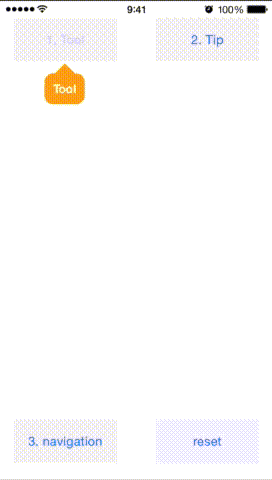

# ToolTipNavigation

This library is a library for managing the display of CMPopTipView. Such as tutorial, you used when you want to display a pop tip with a series of flows.

[]

[](http://cocoadocs.org/docsets/ToolTipNavigation)
[](http://cocoadocs.org/docsets/ToolTipNavigation)
[](http://cocoadocs.org/docsets/ToolTipNavigation)


## Usage

Set String you want to display the tool tip to `altAccessibilityHint` of each View. `[[ToolTipNavigation sharedManager] showInViewController: self];` please have the call.


```
self.button.altAccessibilityHint = @"Tool tip";

[[ToolTipNavigation sharedManager] showInViewController:self];
```

## Installation

ToolTipNavigation is available through [CocoaPods](http://cocoapods.org). To install
it, simply add the following line to your Podfile:

    pod "ToolTipNavigation"

## Author

akuraru, akuraru@gmail.com

## License

ToolTipNavitation is available under the MIT license. See the LICENSE file for more info.

